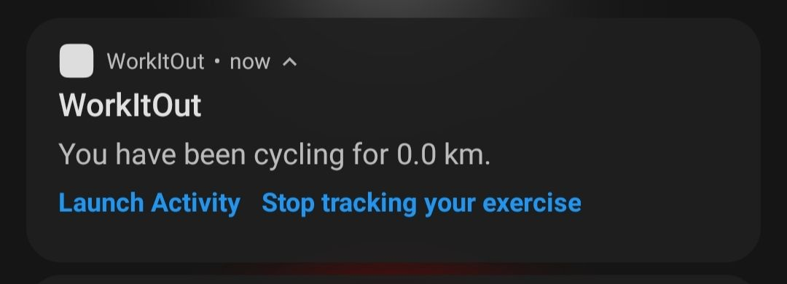

# IF3210-2021-Android-K3-15
## Work Out Application


## Deskripsi Aplikasi
Work It Out adalah aplikasi olahraga yang membantu pengguna dalam menjadwalkan dan mendata kegiatan workout. Pada aplikasi ini, terdapat 4 fungsionalitas utama yaitu:

1. Sport News: pengguna dapat melihat berita olahraga yang diperoleh melalui Indonesia Sports News API. Setiap berita dapat di-klik untuk menampilkan WebView dari konten berita.

2. Training Tracker: pengguna dapat melakukan "mulai" dan "selesai" mengenai pelacakan latihan yang memiliki beberapa jenis Cycling dan Walking. Pelacakan akan disimpan historynya dalam bentuk pencapaian (dan rute cycling) dan ditampilkan pada saat berakhir.

3. Training History: terdapat halaman history yang menyimpan seluruh kegiatan latihan pengguna yang dilacak, ditampilkan dalam bentuk kalender. Setiap hari pada kalender dapat dibuka untuk menampilkan list log latihan dan setiap log dapat dibuka untuk melihat detailnya.

4. Training Scheduler: pengguna dapat menentukan jadwal latihan yang dapat dikustomisasi untuk berjalan secara satu waktu spesifik dan 	rutin (setiap hari atau pada hari tertentu). Scheduler dapat diatur untuk secara otomatis melakukan tracking.


## Cara Kerja
Aplikasi dapat di-build dengan cara mendefinisikan variable berikut pada file local.properties:
```
MAPS_API_KEY=<--REDACTED-->
NEWS_API_KEY=<--REDACTED-->
ENABLE_ALERT_WINDOW=<true|false>
```

ENABLE_ALERT_WINDOW digunakan untuk melakukan over the top display untuk menampilkan history (tidak support pada Android Go sehingga digunakan variable ENV).

### Sport News (***SEMUA TERPENUHI***)
1. Aplikasi WorkItOut kemudian dapat dibuka sehingga menampilkan tampilan awal berupa halaman Sport News. Untuk menampilkan halaman Sport News, kami menggunakan `interface client dan service Retrofit` untuk mengambil data dari News API melalui `view model` pada News. Dengan menggunakan view model, kita dapat menghindari fetching ulang akibat perubahan orientasi sehingga lebih efisien dalam penggunaan bandwidth. Data response dari News API akan diproses dan di-passing kepada `live data`. Live data tersebut telah di-observe oleh `NewsFragment` sehingga perubahannya akan diupdate pada sisi UI.

<div style="text-align:center"></div>

2. Tampilan list berita ditampilkan secara ***responsive***, yaitu pada landscape, akan ditampilkan menjadi 2 kolom (dengan grid). Untuk menghandle responsive ini, kami memanfaatkan `grid layout` untuk menampilkan recyclerview dan data `configuration` pada `activity's resource` berupa orientasi yang akan dicek apakah merupakan landscape atau portrait. Jika orientasi dalam landscape, grid layout akan di-set dengan 2 kolom. Untuk portrait, grid layout akan di-set dengan 1 kolom.

<div style="text-align:center"></div>

3. Jika suatu berita di-klik, akan menampilkan WebView dari konten beritanya. Untuk men-passing data URL dari berita, kami menggunakan argument pada library `Navigation`. Argument dapat di-pass melalui `action` yang dapat di-generate menggunakan kelas `direction` dari hasil build. URL tersebut kemudian akan diberikan kepada WebView untuk ditampilkan.

<div style="text-align:center"></div>


### Tracker (***SEMUA TERPENUHI***)
1. Klik navigasi Tracker di bawah sehingga halaman Tracker akan terbuka. Pada h

<div style="text-align:center"></div>

2. ***Kompas*** akan berotasi menyesuaikan arah mata angin

<div style="text-align:center"></div>

3. Tracking dapat dilakukan dengan memilih tipe latihan (Cycling atau Walking) dan menekan tombol Start Track.

<div style="text-align:center"></div>

4. Notifikasi yang ditampilkan menunjukkan progress latihan, yang berjalan pada ***foreground service***.
- Untuk Cycling

<div style="text-align:center"></div>

- Untuk Walking

<div style="text-align:center"></div>

5. Tracking dihentikan sehingga menyimpan history dan menampilkannya menggunakan intent pada service. (Pada Android Go, digunakan notifikasi untuk menampilkan history)

<div style="text-align:center"></div>

### Training History (***SEMUA TERPENUHI***)
1. Klik navigasi History di bawah sehingga halaman History akan terbuka.

<div style="text-align:center"></div>

2. Klik suatu tanggal pada kalendar untuk menampilkan log list
- Jika ada log

<div style="text-align:center"></div>

- Jika tidak ada log

<div style="text-align:center"></div>

3. Jika terdapat log, klik panah hijau pada log untuk menampilkan detail log tersebut.
- Untuk Cycling

<div style="text-align:center"></div>

- Untuk Walking

<div style="text-align:center"></div>

4. Selain itu, log history dan detailnya juga dapat ditampilkan secara ***responsive menggunakan fragment***.

<div style="text-align:center"></div>

### Training Scheduler (***SEMUA TERPENUHI***)
1. Klik navigasi Schedule di bawah sehingga halaman Schedule akan terbuka. Scheduler akan mengambil semua data schedule yang dijadwalkan untuk nanti (current time < schedule time) melalui DAO dari schedule yang memanfaatkan library `room persistence`. Pengambilan ini dilakukan pada `view model schedule` dengan memanfaatkan `Flow` pada library `Kotlin Coroutine` yang akan di-pass ke `live data` untuk diupdate jika terjadi perubahan pada tabel tersebut. Pada aplikasi kami, kami mendefinisikan 2 tipe schedule, yaitu `single schedule` (satu waktu) dan `routine schedule` (rutin pada hari-hari yang dipilih). Untuk men-schedule setiap hari, Anda dapat memanfaatkan `routine schedule` dengan cara memilih semua hari (senin-minggu). Kedua tipe schedule ini kami wrap menjadi sebuah kelas `Schedule` agar dapat di-pass kepada recycler view seakan-akan sebagai 1 kelas (bukan 2). Data schedule yang diambil kemudian ditampilkan menggunakan `recyclerview` yang diupdate oleh `live data`. Untuk menampilkan tipe latihan, kami menggunakan icon yang cukup jelas membedakan antara cycling dan walking.
Pada halaman ini, pengguna juga dapat melakukan delete schedule. Delete schedule dilakukan dengan melakukan passing object `observer` dari UI kepada `adapter recyclerview`. Observer memiliki method untuk memproses delete jika pengguna menekan icon delete. Delete yang dilakukan dengan menghentikan alarm terkait schedule tersebut melalui request code unik yang dibentuk berdasarkan id schedule. Pembentukan request code akan dijelaskan pada penambahan schedule. Kemudian, schedule delete dari SQLite menggunakan DAO schedule.

<div style="text-align:center"></div>

2. Anda dapat mengaktifkan auto track dengan menekan tombol switch pada kanan atas (dan juga dapat dinonaktifkan). Nilai auto-track (on/off) disimpan menggunakan shared preferences dengan key yang didefisinikan sebagai data boolean. Untuk melakukan auto-track, pengguna perlu memberikan akses kepada aplikasi untuk melakukan request location, activity recognition (step counter), dan system alert window (untuk menampilkan history bahkan saat aplikasi dalam keadaan tertutup, namun opsional bisa melalui notifikasi). Permission system alert window hanya dapat diatur menggunakan intent menuju settings untuk mengatur permission tersebut.

<div style="text-align:center"></div>

3. Anda juga dapat menambahkan schedule baru dengan menekan tombol floating button pada kanan bawah sehingga ditampilkan dialog tipe schedule. Dialog ini ditampilkan dengan memanfaatkan `DialogFragment`. Tombol-tombol pada dialog fragment diberikan onclick listener yang akan mengarahkan ke `AddScheduleFragment` menggunakan `action` dari navigation untuk men-passing `argument`.

<div style="text-align:center"></div>

4. Anda dapat memilih untuk menambahkan schedule satu waktu atau rutin (setiap hari atau pada hari tertentu). Untuk membedakan tampilan, kami menggunakan argument yang di-pass sebelumnya dan mengubah nilai parameter visibility pada UI bagian date & days.
- Satu waktu

<div style="text-align:center"></div>

- Rutin

<div style="text-align:center"></div>

5. Untuk mengisi date dan time, digunakan 2 dialog fragment yang berbeda. Setiap dialog fragment akan diberikan observer yang akan menerima input dari user. Input yang diterima tersebut kemudian langsung ditampilkan dapat format yang sesuai (misal tanggal dalam bentuk YYYY-MM-DD). Alasan kami memisahkan date dan time adalah untuk memastikan agar pengguna menjadwalkan latihan yang mulai dan berakhir di hari yang sama.

<div style="text-align:center"></div>

<div style="text-align:center"></div>

6. Untuk mengisi schedule rutin, klik tombol hari yang diinginkan (bisa lebih dari satu). Hal ini dapat dilakukan dengan menggunakan Set yang menyimpan informasi tanggal yang terpilih dan kita dapat menggunakan set ini untuk mengecek apakah suatu hari telah dipilih atau belum. Jika telah terpilih, kotak icon hari akan lebih terang warnanya.

<div style="text-align:center"></div>

7. Data yang terisi akan divalidasi apakah semuanya sudah terisi. Kemudian dicek apakah waktu mulainya kurang dari waktu berakhir dan apakah waktu latihannya untuk nanti (current time < schedule time, khusus single schedule). Schedule kemudian ditambahkan dengan memanfaatkan `application scope coroutine` (agar tidak membebani main thread), diperoleh id-nya sehingga dapat dibuatkan request code unik untuk pending intent yang digunakan untuk men-trigger notifikasi. Perhitungan id ini dilakukan dengan `id*8` untuk single schedule dan `(id+1)*8 - day - 1` untuk routine schedule. Total indexingnya jika dilihat ada 8, yaitu untuk 7 hari routine schedule + 1 single schedule, sehingga dipastikan unik. Intent akan diberikan `data extra boolean` yang menandakan apakah intent tersebut untuk notifikasi latihan dimulai atau untuk notifikasi latihan berakhir. Untuk menjadwalkan notifikasi, digunakan alarm karena intent-nya dapat diterima walaupun aplikasi dalam keadaan tertutup.
Lalu kita dapat menjadwalkan alarm berdasarkan waktu mulai yang ditentukan. Flownya kurang lebih adalah pembuatan alarm mulai -> notifikasi mulai ditampilkan & pembuatan alarm berakhir -> notifikasi berakhir ditampilkan & intent diperbaiki untuk notifikasi mulai khusus routine schedule. Tahap penampilan notifikasi hingga penampilan notifikasi berakhir dilakukan oleh `ScheduleReceiver` yang menerima intent alarm tersebut. Auto-tracking dapat dilakukan dengan menyertakan operasi `start dan stop foreground service` pada saat penampilan notifikasi.

8. Notifikasi akan ditampilkan saat schedule dimulai dan berakhir. Notifikasi ini ditampilkan dengan mengambil data schedule terkait berdasarkan id yang disimpan pada intent (untuk membedakan single dan routine schedule, digunakan perhitungan yang mirip seperti sebelumnya untuk pembentukan request code unik, namun hanya untuk 2 tipe).


<div style="text-align:center"></div>

<div style="text-align:center"></div>


9. Auto-track yang dilakukan saat schedule dimulai dan berakhir akan menampilkan notifikasi tracking. Cara kerja-nya sama seperti pada halaman tracker, yaitu akan di-start foreground service saat schedule dimulai dan di-stop saat schedule berakhir.

<div style="text-align:center"></div>


## Library yang Digunakan

### Constraint Layout
Library ini digunakan untuk mendefinisikan Contraint Layout pada layout.

### AppCompat
Library ini digunakan untuk mendefinisikan AppCompatActivity yang mensupport Material Design.

### Google Material Design
Library ini digunakan untuk mendefinisikan komponen-komponen material seperti Snack dan FloatingActionButton.

Contoh penggunaan dari library ini pada aplikasi kami adalah:
- MainActivity: untuk mendefinisikan BottomNavigationView
- ScheduleFragment (pada package ui.schedule): untuk mendefinisikan FloatingActionButton

### Room Persistence
Library ini digunakan untuk membaca dan menuliskan data pada SQLite dengan cara memberikan layer abstraksi.

Contoh penggunaan dari library ini pada aplikasi kami adalah:
- kelas-kelas entity (pada package entity) : untuk mendefinisikan tabel-tabel pada SQLite
- interface dao (pada package dao): untuk mendefinisikan operasi query berupa select, delete, insert, dan update pada entity
- kelas-kelas converter (pada package entity): untuk melakukan konversi antara data pada SQLite dan data pada Kotlin (berlaku 2 arah)
- kelas database (pada package database): untuk mendefinisikan database pada SQLite yang menyimpan entity.

### Retrofit
Library ini digunakan untuk mengambil data dari sebuah REST API dan di-mapping ke sebuah data class.

Contoh penggunaan dari library ini pada aplikasi kami adalah:
- NewsAPIClient (pada package data.api): untuk membangun klien yang dapat mengakses data API 	
- NewsAPIService (pada package data.api): untuk mendefinisikan REST API yang digunakan dan data yang diterimanya
- NewsViewModel (pada package data.api): untuk melakukan pemanggilan REST API News, serta memperoleh response dan error

### Navigation
Library ini digunakan untuk mendefinisikan dan mengatur navigasi.

Contoh penggunaan dari library ini pada aplikasi kami adalah:
- MainActivity: untuk mendefinsikan dan mensetup navigation ui (bottom navigation)
- AddScheduleFragment (pada package ui.schedule): untuk memperoleh argument pada fragment tersebut (safe args)
- ScheduleTypeDialog (pada package ui.schedule): untuk melakukan navigasi ke fragment AddScheduleFragment setelah menekan tombol

### Lifecycle
Library ini digunakan untuk mendefinisikan komponen lifecycle seperti ViewModel dan live data

Contoh penggunaan dari library ini pada aplikasi kami adalah:
- HistoryViewModel (pada package ui.history): untuk mendefinisikan ViewModel dan providernya, serta mendefinisikan live data

### Kotlin Coroutine
Library ini digunakan untuk mendefinisikan coroutine yang mengerjakan suatu task dan berjalan di luar UI thread.

Contoh penggunaan dari library ini pada aplikasi kami adalah:
- WorkOutApplication: untuk mendefinisikan application scope coroutine
- ScheduleViewModel (pada package ui.schedule): untuk menjalankan operasi pada viewmodel scope sehingga tidak membebani UI thread (non-blocking)
- TrackingService (pada package services): untuk melakukan insert history dan memperoleh id
- AddScheduleFragment (pada package ui.schedule): untuk melakukan insert schedule dan memperoleh id
- ScheduleReceiver (pada package receivers): untuk mengambil data schedule yang berkaitan
- ScheduleDao (pada package dao): untuk memperoleh data Flow, async data yang akan diupdate jika terjadi perubahan data pada database

### Google Mobile Services
Library ini digunakan untuk menyediakan servis google pada mobile berupa location tracking dan Map API.

Contoh penggunaan dari library ini pada aplikasi kami adalah:
- HistoryDetailFragment (pada package ui.history): untuk me-load dan menampilkan google map (rute cycling) pada 
- TrackingService (pada package services): untuk memperoleh informasi lokasi sekarang secara berkala

### Glide
Library ini digunakan untuk melakukan fetching gambar dan menampilkan.

Contoh penggunaan dari library ini pada aplikasi kami adalah:
- NewsAdapter (pada package ui.news): untuk mengambil gambar headline news dan menampilkannya pada ImageView


## Pembagian Kerja
1. Muhammad Ravid Valiandi (13518099)
- Sport News UI
- News API
- Buat README


2. Muhammad Firas (13518117)
- Sensor Compass
- Buat README


3. Yonatan Viody (13518120)
- Sport News UI
- Training Tracker UI
- Training History UI
- Tracking Service
- Training Scheduler UI
- History & Schedule Data
- Map API
- Notification API
- Auto-Track
- Responsive: News & History
- Buat README
